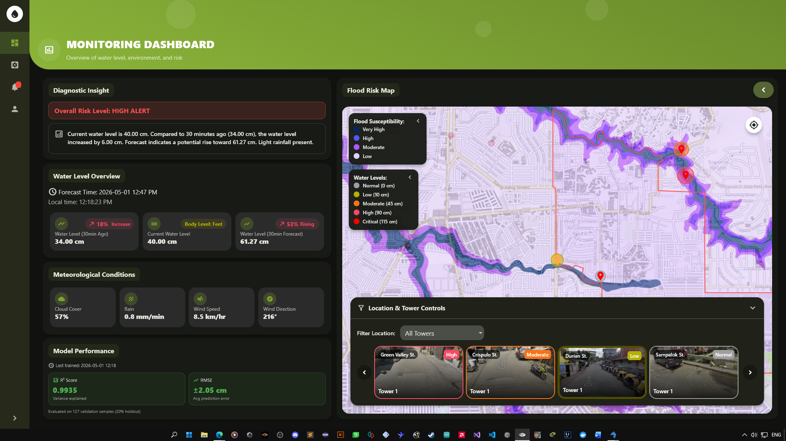
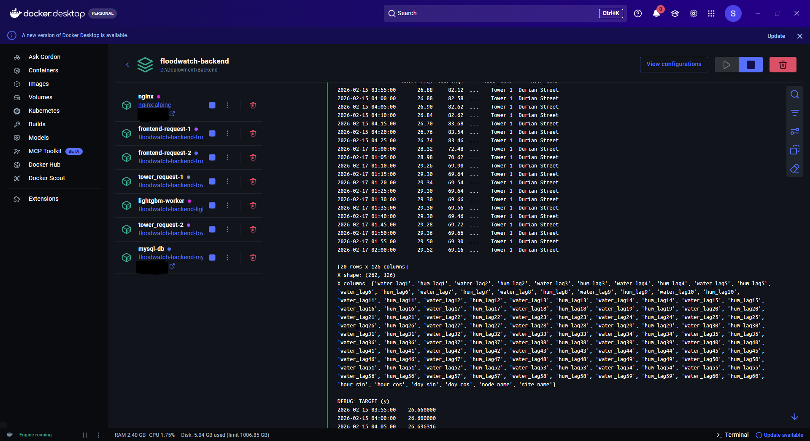
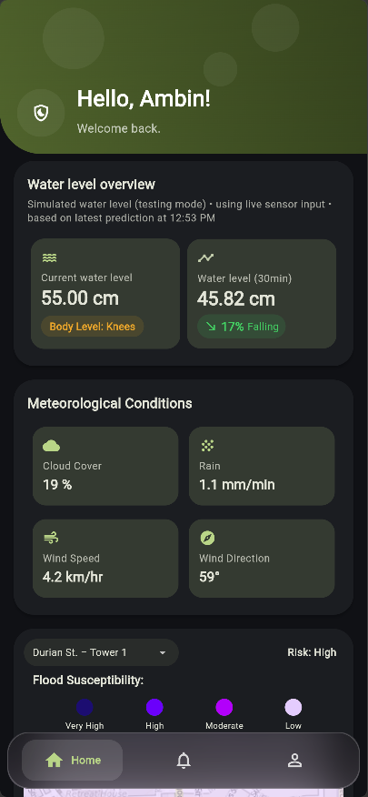
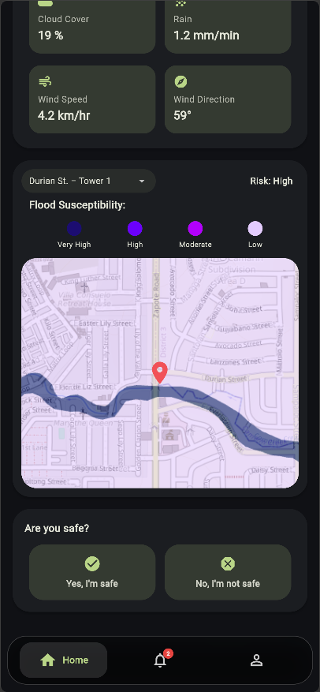
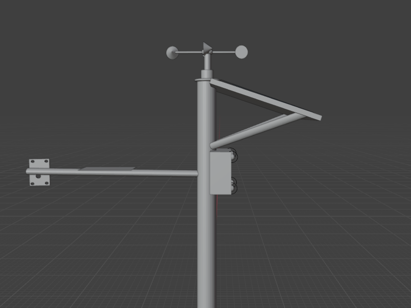
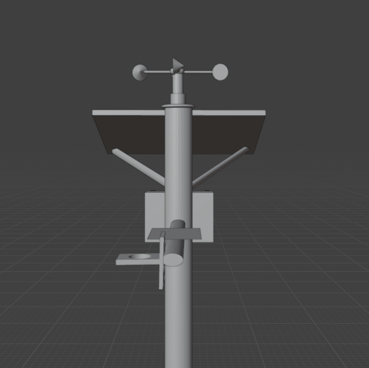
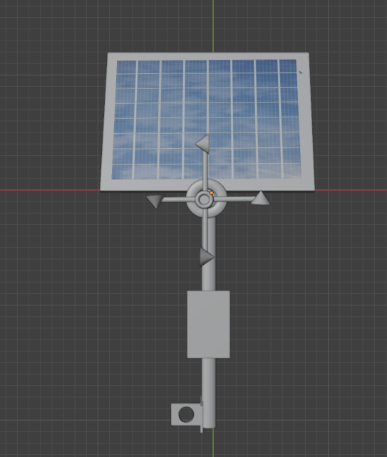

# FloodWatch (Under Developemnt)

### Core Technologies
[](https://www.python.org/)
[](https://flutter.dev/)
[](https://lightgbm.readthedocs.io/)
[](https://www.mysql.com/)

### Infrastructure & Deployment
[](https://www.docker.com/)
[](https://nginx.org/)
[](https://docs.pylonsproject.org/projects/waitress/en/stable/)
[](https://developers.cloudflare.com/cloudflare-one/connections/connect-apps/)

**Research Paper Reference:**  
*"Real-Time Flood Monitoring System with Water Level Forecasting using LoRaWAN-Based Wireless Sensor Network"*

---

## Overview
FloodWatch is an IoT-based flood monitoring system that detects rising water levels in real-time, generates forecasts, and sends alerts to residents and barangay officials. 

Unlike traditional flood monitoring systems, FloodWatch integrates machine learning-based forecasting and low-power LoRaWAN communication to enable predictive, real-time community alerts even in low-connectivity areas. It combines distributed sensor nodes, wireless communication, a containerized cloud backend, and Flutter applications for both residents and administrators.

## System Screenshots

## System Screenshots

<p align="center"><b>Resident Mobile Interface</b></p>
<p align="center">
  
</p>

<p align="center"><b>Admin Dashboard</b></p>
<p align="center">
  
</p>

<p align="center"><b>Mobile App: Node & Data Views</b></p>
<p align="center">
  
  
</p>

<p align="center"><b>Dashboard: Sensor & Forecast Views</b></p>
<p align="center">
  
  
  
</p>

---

## System Components

- **Resident Application** – Cross-platform Flutter app for web and mobile. Allows residents to view real-time flood data, forecasts, and alerts.
- **Admin Dashboard** – Desktop Flutter app for monitoring system status, managing sensor data, and supporting decision-making for authorities.
- **Backend API** – Containerized Python server using Docker, Waitress, and NGINX. Handles data processing, storage (MySQL), and flood prediction via LightGBM.
- **Sensor Nodes (LoRa32)** – Field units with FMCW radar, rain sensors, and anemometers. Powered by 12V 9Ah with solar support, sending data via LoRaWAN.

---

## System Architecture

```text
Sensor Nodes (LoRa32)
        ↓
LoRa Gateway
        ↓
Backend API (Docker + Python)
        ↓
Data Processing & LightGBM Forecasting
        ↓
MySQL Database
        ↓
REST/WebSocket API
        ↓
Resident App / Admin Dashboard
```

---

## Features
- Real-time water level monitoring
- Flood prediction using LightGBM
- Mobile & web-based alerts
- Offline-capable LoRa communication
- Admin monitoring dashboard with analytics

---

## Repositories (Private)

The backend, mobile, and desktop applications are maintained in private repositories due to security and research considerations.

Access can be requested via:
753951852456arvin@gmail.com

---
