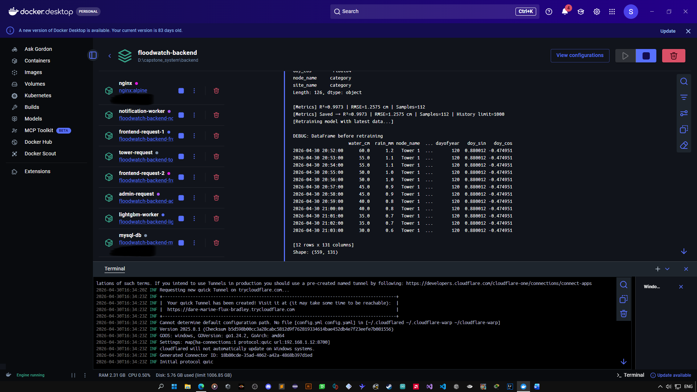

# FloodWatch (Under Developemnt)

[](https://www.python.org/)
[](https://lightgbm.readthedocs.io/)
[](https://docs.pylonsproject.org/projects/waitress/en/stable/)
[](https://flutter.dev/)
[](https://www.docker.com/)
[](https://nginx.org/)
[](https://developers.cloudflare.com/cloudflare-one/connections/connect-apps/)
[](https://www.mysql.com/)

**Research Paper Reference:**  
*"Real-Time Flood Monitoring System with Water Level Forecasting using LoRaWAN-Based Wireless Sensor Network"*

---

## Overview
FloodWatch is an IoT-based flood monitoring system that detects rising water levels in real-time, generates forecasts, and sends alerts to residents and barangay officials. It integrates distributed sensor nodes, wireless LoRaWAN communication, a containerized cloud backend, and Flutter applications for community users and administrators.

## System Screenshots

<p align="center">
  
</p>

<p align="center">
  
</p>

<p align="center">
  
  
</p>

<p align="center">
  
  
  
</p>

---

## System Components

- **Resident Application** – A cross-platform interface built with Flutter for web and mobile devices, allowing community members to view real-time flood data, forecasts, and receive alerts.
- **Admin Dashboard** – A desktop-based application developed using Flutter, designed for monitoring system status, managing data, and supporting decision-making for authorities.
- **Backend API** – A containerized server powered by Docker and Python, utilizing Waitress and NGINX for request handling, MySQL for data storage, and LightGBM for flood prediction and forecasting.
- **Sensor Nodes (LoRa32)** – Distributed field units installed on monitoring towers, equipped with FMCW radar, rain sensors, and anemometers. These nodes operate on a 12V 9Ah power system with solar support and communicate via LoRa-based wireless transmission.

---

## System Architecture

```text
Tower Sensors (LoRa32) → LoRa32 Gateway → Backend API (Docker) → MySQL Database → Applications (Resident Web/App / Admin Dashboard)
```

---

## Repositories (Private)

The backend, mobile, and desktop applications are maintained in private repositories due to security and research considerations.

Access can be requested via:
753951852456arvin@gmail.com

---
